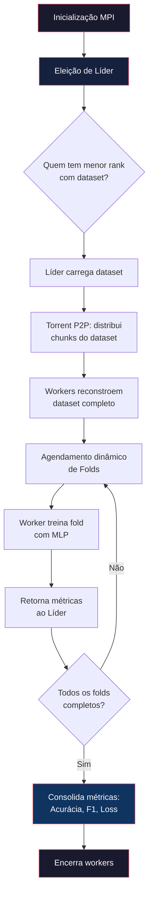

<p align="center">
  
  
  
  
  
</p>

<h1 align="center">⚡ DistriFold</h1>

<p align="center">
  <strong>Rede distribuída de treinamento descentralizado via K-Fold Cross-Validation com OpenMPI</strong>
</p>

<p align="center">
  <em>Acelere a validação cruzada de modelos de IA distribuindo os K folds entre múltiplos nós MPI, com tolerância a falhas, eleição de líder e distribuição P2P do dataset.</em>
</p>

---

## 📖 Sobre o Projeto

O **DistriFold** é um sistema distribuído que paraleliza o treinamento de modelos de IA usando **K-Fold Cross-Validation**. Ao invés de treinar todos os folds sequencialmente em uma única máquina, o sistema distribui cada fold para nós diferentes numa rede MPI, acelerando o processo proporcionalmente ao número de nós disponíveis.

### Por que K-Fold distribuído?

O K-Fold Cross-Validation é a técnica padrão para avaliar modelos de ML sem viés de partição, mas exige treinar o modelo **K vezes**. Com 8 folds e um modelo que leva 30 segundos por treino, são **4 minutos sequenciais**. Com 4 workers distribuídos, esse tempo cai para aproximadamente **1 minuto**.

```
Speedup teórico:  T_total ≈ T_1fold × (K / N_workers)
```

---

## 🏗️ Arquitetura

O sistema segue uma arquitetura **Líder-Seguidor** mediada por OpenMPI com consistência eventual:

```
┌─────────────────────────────────────────────────────────────────────┐
│                        CLUSTER MPI                                  │
│                                                                     │
│   ┌──────────────┐     Heartbeat / Sync      ┌──────────────┐      │
│   │   Nó 0       │◄─────────────────────────► │   Nó 1       │      │
│   │  (Líder)     │       TAG_HELLO            │  (Worker)    │      │
│   │              │       TAG_STATE_SYNC        │              │      │
│   │  • Agenda    │                            │  • Treina    │      │
│   │    folds     │       TAG_TASK ──────────► │    fold      │      │
│   │  • Coleta    │ ◄────── TAG_RESULT         │  • Retorna   │      │
│   │    métricas  │                            │    métricas  │      │
│   │  • Monitora  │                            │              │      │
│   │    saúde     │                            └──────────────┘      │
│   │              │                                                   │
│   │              │       TAG_TASK ──────────► ┌──────────────┐      │
│   │              │ ◄────── TAG_RESULT         │   Nó 2       │      │
│   │              │                            │  (Worker)    │      │
│   └──────────────┘                            └──────────────┘      │
│                                                                     │
│   ◄──── Torrent P2P (TAG_TORRENT_*) ────►                          │
│   Distribuição descentralizada do dataset entre todos os nós        │
└─────────────────────────────────────────────────────────────────────┘
```

### Fluxo de execução



---

## 📂 Estrutura do Projeto

```
DistriFold/
├── 📦 Dockerfile              # Imagem com Python 3.11 + OpenMPI
├── 📦 docker-compose.yml      # Orquestração com Podman/Docker Compose
├── 📋 requirements.txt        # Dependências Python
├── 📋 .dockerignore            # Exclusões do build context
│
├── src/
│   ├── 🚀 MPI_start.py        # Ponto de entrada — orquestrador principal
│   ├── 🧠 MLP.py              # Rede neural MLP (backprop manual com NumPy)
│   ├── 👑 leader.py            # Lógica do Líder (agendamento + coleta)
│   ├── ⚙️  worker.py           # Lógica do Worker (treino + retorno)
│   ├── 🌐 node_context.py     # Estado global compartilhado de cada nó
│   ├── 📝 logger.py            # Logger com saída em arquivo + console
│   ├── 🧹 clear_locals.py     # Limpa dados locais para simular nós novos
│   │
│   ├── communication/
│   │   ├── 📡 communication.py      # Serviço de comunicação (heartbeat, eleição)
│   │   ├── 🏷️  communication_tags.py # Tags MPI para tipos de mensagem
│   │   ├── 🔌 network.py            # Abstração thread-safe do MPI (send/recv)
│   │   └── 🌊 torrent.py            # Engine P2P para distribuição do dataset
│   │
│   └── Locals/                 # Dados locais de cada nó (gerados em runtime)
│       └── Rank 0/
│           └── breast_cancer.npz   # Dataset seed inicial
│
└── tests/
    ├── 🧪 run_tests.py         # Suíte completa de 9 testes distribuídos
    ├── 🧪 test_MPI_start.py    # Entry point dos testes (monkey-patching)
    └── 🔧 utils.py             # Utilitários: run_mpi, search_log, etc.
```

---

## 🧩 Componentes Principais

### 🚀 Orquestrador (`MPI_start.py`)

Ponto de entrada do sistema. Cada processo MPI cria um `MainNode` que gerencia três threads concorrentes:

| Thread | Responsabilidade |
|--------|-----------------|
| **Comm** | Heartbeats, eleição de líder, sincronização de estado |
| **Leader** | Agendamento dinâmico de folds, coleta de resultados |
| **Worker** | Download do dataset via torrent, treinamento de folds |

### 👑 Líder (`leader.py`)

- Carrega o dataset e inicia a distribuição P2P via torrent
- Mantém uma fila de **folds pendentes** e atribui dinamicamente a workers que estão prontos
- Monitora a saúde dos workers via heartbeat com timeout
- Se um worker cair, o fold é devolvido à fila de pendentes
- Ao final, consolida as métricas (Acurácia, F1-Score, Loss)

### ⚙️ Worker (`worker.py`)

- Baixa o dataset completo via **protocolo P2P** (torrent)
- Solicita trabalho ao líder e treina folds localmente
- Retorna métricas e pesos ao líder após cada fold

### 🧠 MLP (`MLP.py`)

Rede neural MLP com backpropagation manual implementada 100% em NumPy:

- **Arquitetura**: Input → 64 neurônios (ReLU) → 16 neurônios (ReLU) → Output (Softmax)
- **Regularização**: Dropout + L2
- **Early Stopping**: Restaura melhores pesos com paciência configurável
- **Métricas**: Acurácia, Precision, Recall, F1-Score, Loss

### 📡 Comunicação (`communication/`)

| Módulo | Função |
|--------|--------|
| `communication.py` | Eleição de líder (menor rank ativo), heartbeat, detecção de falhas e retorno |
| `network.py` | Wrapper thread-safe para `MPI.isend` / `MPI.iprobe` / `MPI.recv` |
| `torrent.py` | Distribuição P2P do dataset em chunks (inventário HAVE, requests, seeding) |
| `communication_tags.py` | Constantes de tags MPI para tipagem das mensagens |

---

## 🛡️ Tolerância a Falhas

O sistema implementa três mecanismos de resiliência:

| Cenário | Mecanismo |
|---------|-----------|
| **Worker cai** | Líder detecta timeout → fold retorna à fila de pendentes → outro worker assume |
| **Líder cai** | Workers detectam timeout → nova eleição por menor rank com dataset → novo líder recupera contexto |
| **Nó retorna** | Nó faz broadcast perguntando pelo líder → sincroniza contexto → retoma como worker |

A consistência é **eventual**: o estado global só é consolidado após todos os folds serem completados, permitindo que falhas individuais sejam resolvidas por re-execução sem comprometer a integridade estatística.

---

## 🐳 Como Rodar

### Pré-requisitos

- [Podman](https://podman.io/getting-started/installation) (ou Docker como alternativa)
- [Podman Compose](https://github.com/containers/podman-compose) (opcional, para usar `docker-compose.yml`)

### Opção 1 — Podman direto (recomendado)

```bash
# 1. Build da imagem
podman build -t distrifold .

# 2. Rodar com 2 nós MPI (1 líder + 1 worker)
podman run --rm distrifold

# 3. Rodar com mais nós (ex: 4 nós = 1 líder + 3 workers)
podman run --rm -e NUM_NODES=4 distrifold

# 4. Persistir os logs numa pasta local
podman run --rm -v ./output:/app/src/Locals distrifold
```

### Opção 2 — Podman Compose

```bash
# Rodar com configuração padrão (2 nós)
podman compose up --build

# Rodar com 4 nós
NUM_NODES=4 podman compose up --build

# Rodar a suíte de testes
podman compose --profile test up --build tests
```

### Opção 3 — Sem container (local)

```bash
# Instalar dependências (requer OpenMPI instalado no sistema)
pip install -r requirements.txt

# Limpar dados de execuções anteriores
python src/clear_locals.py

# Rodar com 2 processos MPI
mpiexec -n 2 python -B src/MPI_start.py

# Rodar com 4 processos MPI
mpiexec -n 4 python -B src/MPI_start.py
```

---

## 🧪 Testes

A suíte contém **9 cenários** de teste automatizados:

| # | Teste | O que valida |
|---|-------|-------------|
| 1 | **Eleição de Líder** | Líder inicial cai → novo líder é eleito |
| 2 | **Elegibilidade** | Nó sem dataset não pode ser eleito líder |
| 3 | **Distribuição P2P** | Todos os nós reconstroem o dataset via torrent |
| 4 | **Balanceamento Dinâmico** | Worker rápido recebe mais folds que o lento |
| 5 | **Falha de Worker** | Fold do worker morto é reatribuído |
| 6 | **Falha do Líder** | Novo líder recupera contexto e completa treino |
| 7 | **Sincronização de Estado** | Workers mantêm réplicas de estado sincronizadas |
| 8 | **Recuperação de Nós** | Nó que volta sincroniza contexto com o líder |
| 9 | **Escalabilidade** | Mais nós → menor tempo total de treinamento |

```bash
# Via container
podman compose --profile test up --build tests

# Localmente
python tests/run_tests.py
```

---

## ⚙️ Configuração

Os parâmetros podem ser ajustados diretamente em `src/MPI_start.py`:

```python
# Dataset utilizado
DATASET_ID = "breast_cancer"

# Configuração do K-Fold
CONFIG_FOLD = {
    "n_splits": 8,         # Número de folds
    "shuffle": True,       # Embaralha antes de dividir
    "random_state": 42     # Seed para reprodutibilidade
}

# Configuração da MLP
CONFIG_MLP = {
    "h1": 64,              # Neurônios na 1ª camada oculta
    "h2": 16,              # Neurônios na 2ª camada oculta
    "lr": 0.001,           # Taxa de aprendizado
    "epochs": 200,         # Épocas máximas de treino
    "batch_size": 4        # Tamanho do batch
}

# Simulação de falhas (para testes)
TESTE_REDUNDANCIA = {
    0: {'time_working': 15, 'time_timeout': 6},  # Nó 0 cai após 15s
    1: {'time_working': 0,  'time_timeout': 0}   # Nó 1 sempre ativo
}
```

---

## 🔧 Stack Tecnológica

| Tecnologia | Versão | Propósito |
|-----------|--------|-----------|
| **Python** | 3.11 | Linguagem principal |
| **OpenMPI** | 4.x | Runtime de comunicação entre processos distribuídos |
| **mpi4py** | 4.1 | Bindings Python para MPI |
| **NumPy** | 2.x | Computação numérica (MLP, manipulação de arrays) |
| **scikit-learn** | 1.9 | K-Fold splitting, métricas de avaliação, dataset |
| **matplotlib** | 3.x | Geração de gráficos nos testes |
| **Podman** | — | Containerização para execução reproduzível |

---

## 📊 Exemplo de Saída

```
[Líder 0] Iniciando agendamento dinâmico dos 8 Folds...
[Líder 0] Atribuiu Fold 0 para o Worker 1
[Worker 1] Treinando Fold 0...
[Worker 1] Concluiu e enviou métricas do Fold 0
[Líder 0] Sucesso! Recebido resultado do Fold 0 do Worker 1
...
Final:
Fold 0: Acurácia = 0.9577 | F1-Score = 0.9565 | Loss = 0.1234
Fold 1: Acurácia = 0.9437 | F1-Score = 0.9420 | Loss = 0.1567
Fold 2: Acurácia = 0.9718 | F1-Score = 0.9710 | Loss = 0.0987
...
Acurácia Média : 0.9580 ± 0.0120
F1-Score Médio : 0.9570 ± 0.0115
Loss Média     : 0.1230 ± 0.0190
```

---

<p align="center">
  Desenvolvido para a disciplina de <strong>Sistemas Distribuídos</strong>
</p>
